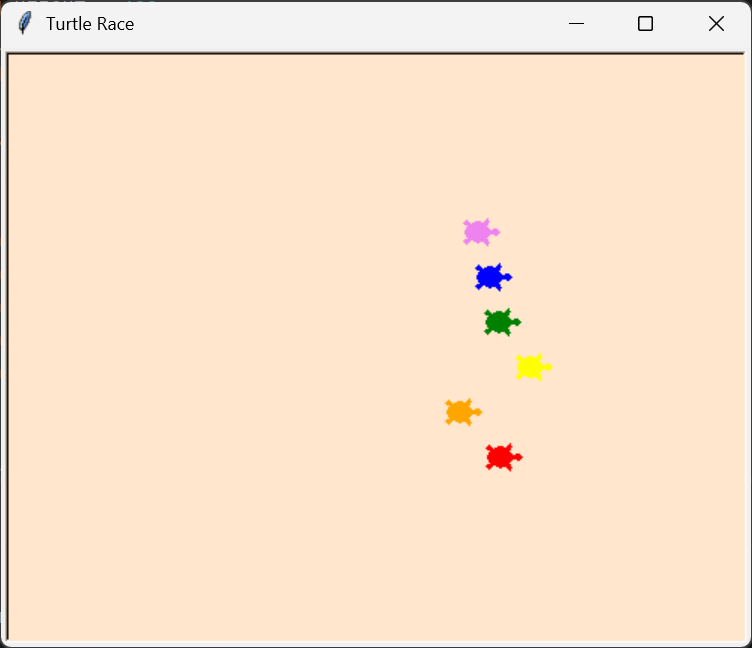

# 🐢 Turtle Race

A fun and interactive Python game where you bet on a turtle and watch them race to the finish line! Each turtle moves a random distance each turn until one reaches the finish line.



## 📋 Features

- **Interactive Betting System** - Choose which turtle color you think will win
- **Random Movement** - Each turtle moves a random distance each turn (0-10 pixels)
- **6 Colored Turtles** - Race with red, orange, yellow, green, blue, and violet turtles
- **Instant Feedback** - Get notified immediately if you win or lose
- **User-Friendly UI** - Built with Python Turtle graphics and Tkinter message boxes

## 🎯 Topics Covered

- Python Turtle graphics
- Functions, lists, and loops
- Random number generation
- User input and validation
- RGB background colors
- Tkinter message boxes
- Code comments and project documentation

## 🚀 How to Run

### Prerequisites
- Python 3.x installed on your system
- No external packages needed (uses only built-in libraries: `turtle` and `tkinter`)

### Installation & Usage

1. **Clone the repository:**
   ```bash
   git clone https://github.com/HeyNia/Turtle-Race.git
   cd Turtle-Race
   ```

2. **Run the game:**
   ```bash
   python main.py
   ```

3. **Play the game:**
   - A dialog box will appear asking you to choose a turtle color
   - Type the color name (e.g., "red", "blue", "green")
   - Watch the turtles race!
   - See if your bet wins! 🎉

## 🎮 Game Rules

- Choose a turtle color (red, orange, yellow, green, blue, or violet)
- All turtles move at the same time, but a random distance each turn
- The first turtle to reach the right side of the screen wins
- If your chosen turtle wins, you win! Otherwise, you lose.

## 📁 Project Structure

```
Turtle-Race/
├── main.py              # Main game script
├── README.md            # This file
└── turtle-race.png      # Screenshot of the game
```

## 🔧 Code Overview

### Key Components

- **`create_turtles()`** - Initializes 6 turtles with different colors and positions
- **Screen Setup** - Creates a 500x400 window with a light peach background
- **Game Loop** - Continuously moves turtles until one wins
- **Input Validation** - Ensures the user enters a valid color

### Constants

- `SCREEN_WIDTH`: 500 pixels
- `SCREEN_HEIGHT`: 400 pixels
- `COLORS`: List of 6 available turtle colors
- `Y_POSITIONS`: Starting vertical positions for each turtle

## 📝 License

This project is open source and available under the MIT License.

## 🤝 Contributing

Feel free to fork this repository and submit pull requests with improvements!

## 💡 Ideas for Enhancement

- Add difficulty levels (turtle speed multipliers)
- Add a betting amount feature
- Track win/loss statistics
- Add sound effects
- Create a GUI leaderboard

---

**Happy Racing! 🏁**
